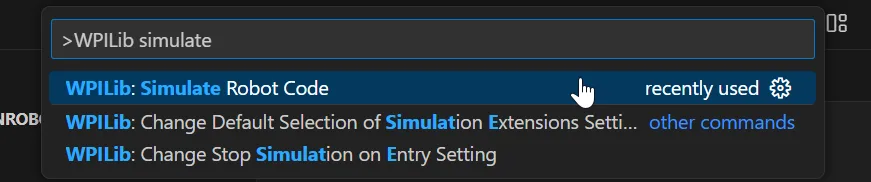
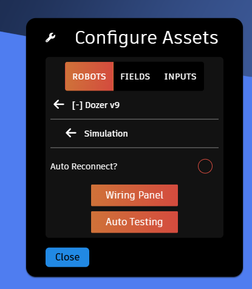
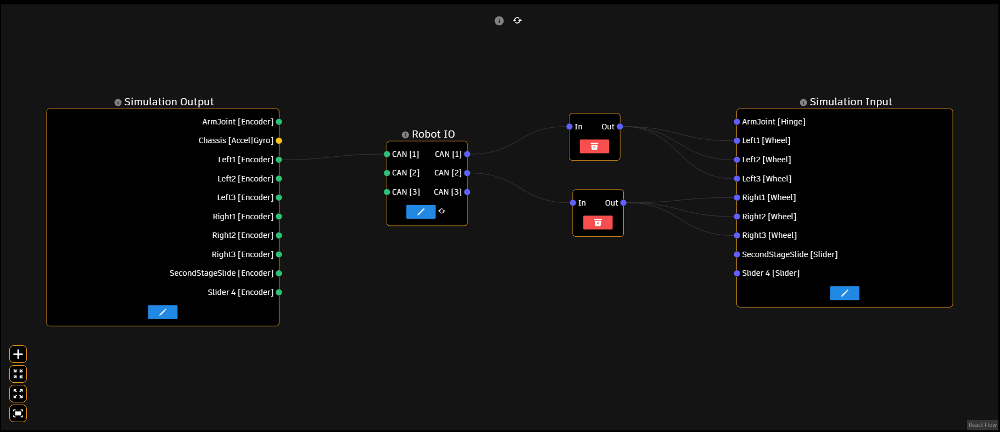
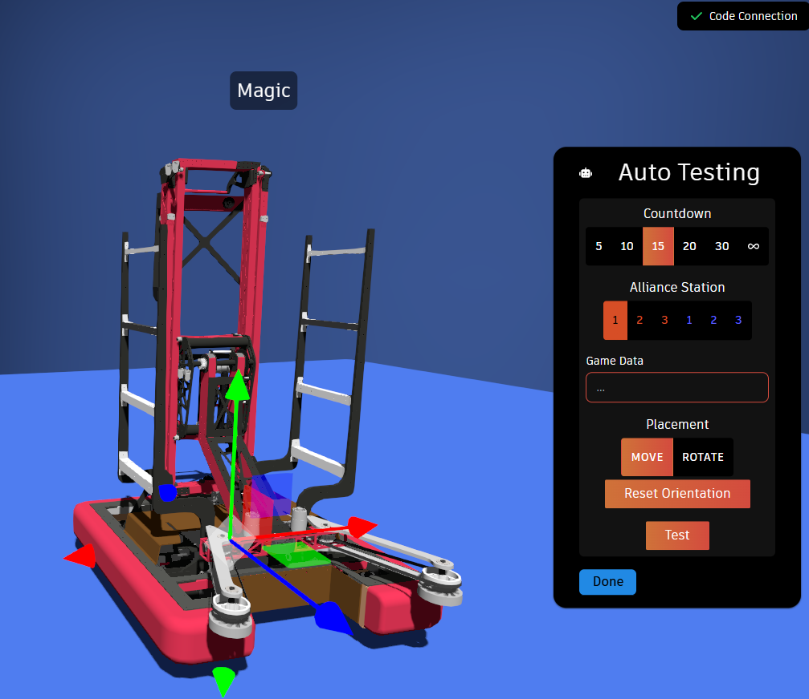

author: Synthesis Team
summary: Tutorial for simulating code in Synthesis
id: CodeSimulationCodelab
tags: WPILib, Code, C++, Java
categories: WPILib
environments: Synthesis, VSCode
status: Published
feedback link: https://github.com/Autodesk/synthesis/issues

# Code Simulation in Synthesis

## Setup (Robot Code Side)

The Synthesis simulator comes with code simulation already integrated. However, a development environment for what ever code your are trying to simulate will be required.
Synthesis' code simulation relies on the WPILib HALSim extensions, specifically the websocket-client extension. You'll need to make the following changes to your `build.gradle` in order to properly simulate your code in Synthesis.

### 1. Desktop Support

You'll need to enable desktop support for your project in order to run the HALSim:

```java
def includeDesktopSupport = true
```

### 2. Websocket Server Extension

In order to communicate with your browser, you'll need to enable the websocket server extension with the following:

```java
wpi.sim.envVar("HALSIMWS_HOST", "127.0.0.1")
wpi.sim.addWebsocketsServer().defaultEnabled = true
```

### 3. SyntheSim (Optional)

For CAN-based device support (TalonFX, CANSparkMax, most Gyros), you'll need our own library--SyntheSim. Currently only available for Java, SyntheSim adds additional support for third party devices that don't follow WPILib's web socket specification. It's still in early development, so you'll need to clone and install the library locally in order to use it:

```sh
$ git clone https://github.com/Autodesk/synthesis.git
$ cd synthesis/simulation/SyntheSimJava
$ ./gradlew build && ./gradlew publishToMavenLocal
```

Next, you'll need to have the local maven repository is added to your project by making sure the following is included in your `build.gradle` file:

```java
repositories {
  mavenLocal()
  ...
}
```

Finally, you can add the SyntheSim dependency to your `build.gradle`:

```java
dependencies {
  ...
  implementation "com.autodesk.synthesis:SyntheSimJava:1.0.0"
  ...
}
```

All of these instructions can be found in the [SyntheSim README](https://github.com/Autodesk/synthesis/blob/prod/simulation/SyntheSimJava/README.md).

SyntheSim is very much a work in progress. If there is a particular device that isn't compatible, feel free to head to our [GitHub](https://github.com/Autodesk/synthesis) to see about contributing.

### 4. HALSim GUI

This should be added by default, but in case it isn't, add this to your `build.gradle` to enable the SimGUI extension by default.

```java
wpi.sim.addGui().defaultEnabled = true
```

This will allow you to change the state of the robot, as well as hook up any joysticks you'd like to use during teleop. You must use this GUI in order
to bring your robot out of disconnected mode, otherwise we won't be able to change the state of your robot from within the app.

### 5. Start your code

To start your robot code, you can use the following simulate commands with gradle:

```bash
$ ./gradlew simulateJava
```

or for C++:

```bash
$ ./gradlew simulateNative
```

WPILib also has a command from within VSCode you can use the start your robot code:



## Setup (Synthesis Web-app Side)

Once started, make sure in the SimGUI that your robot state is set to "Disabled", **not** "Disconnected".

### Spawning in a Robot

Open up [Fission](https://synthesis.autodesk.com/fission/) and spawn in a robot. Once spawned in, place it down and open the config panel. This can be
done by using the left-hand menu and navigating to your robot in the config panel, or by right-clicking on your robot and selecting the "Configure" option.

Next, switch the brain currently controlling the robot. In order to give the simulation control over the robot, the brain must be switched from "Synthesis"
to "WPILib". At the moment, only one robot can be controlled by the simulation at a time.

In the top-right, there should be a connection status indicator. If your robot program was running prior to switching to the "WPILib" brain, it should connect
quickly.

### Simulation Configuration

Under your robot in the config panel, there should be a Simulation option now. Here you can find all the settings for the code simulation.



#### Auto Reconnect

You can enabled auto reconnect incase you are having issues with this. In order for it to take affect, you have to enable the setting, then switch back to the "Synthesis"
brain and then back again to the "WPILib" brain. This setting will be saved.

#### Wiring Panel

This panel can be used to "wire up" your robot. It will show you all the inputs and outputs available from both the simulation and robot. The handles (little circles with
labels) are colored to indicate the type of data they represent. Hover over the information icons for more information.



The bottom-left controls can be used to zoom in/out, fit your view to the nodes, and add junction nodes for connection many connections to many connections.

#### Auto Testing

The Auto Testing panel allows for iterative testing of an autonomous routine. I'd recommend making sure that the auto reconnect option is enabled.



You can specify a max time, alliance station, and game data. Once you've decided on those and have place the robot where you want, you can start your auto routine.
After the specified amount of time, or when the stop button is pressed, the simulation will freeze and you can either reset to where you started, or close the panel.

## Need More Help?

If you need help with anything regarding Synthesis or it's related features please reach out through our
[discord server](https://www.discord.gg/hHcF9AVgZA). It's the best way to get in contact with the community and our current developers.
